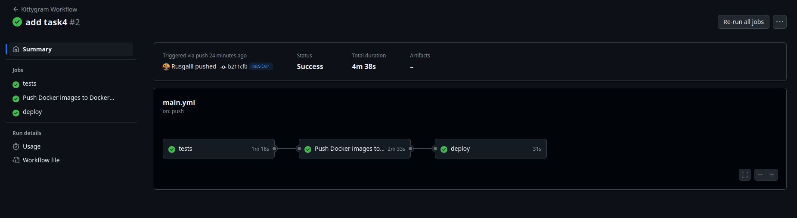

## Контейнеры

|      Имя образа       |   Название контейнера в docker-compose.yml   |
| :-------------------: | :------------------------------------------: |
|   kittygram_gateway   |                    gateway                   |
|   kittygram_backend   |                    backend                   |
|  kittygram_frontend   |                   frontend                   |
|      postgres:13      |                   postgres                   |

## Docker volumes

Подключены Docker volumes:
- static — для хранения файлов статики контейнеров backend и frontend. Доступ к этому volume есть у контейнера gateway, чтобы Nginx мог раздавать эти файлы
- media — для хранения файлов, загружаемых пользователями. Доступ к этому volume есьб у контейнера backend, и у контейнера gateway, чтобы Nginx мог раздавать эти файлы
- pg_data — для хранения данных PostgreSQL из контейнера postgres

## CI/CD
В файле .github/workflows/main.yml:

- Проверяет код бэкенда в репозитории на соответствие PEP8.
- Запускает тесты для фронтенда и бэкенда
- Собирает образы проекта и отправлять их на Docker Hub
- Обновляет образы на сервере и перезапускает приложение при помощи Docker Compose
- Выполняет команды для сборки статики в приложении бэкенда, переносит статику в volume, выполняет миграции

Результат:
